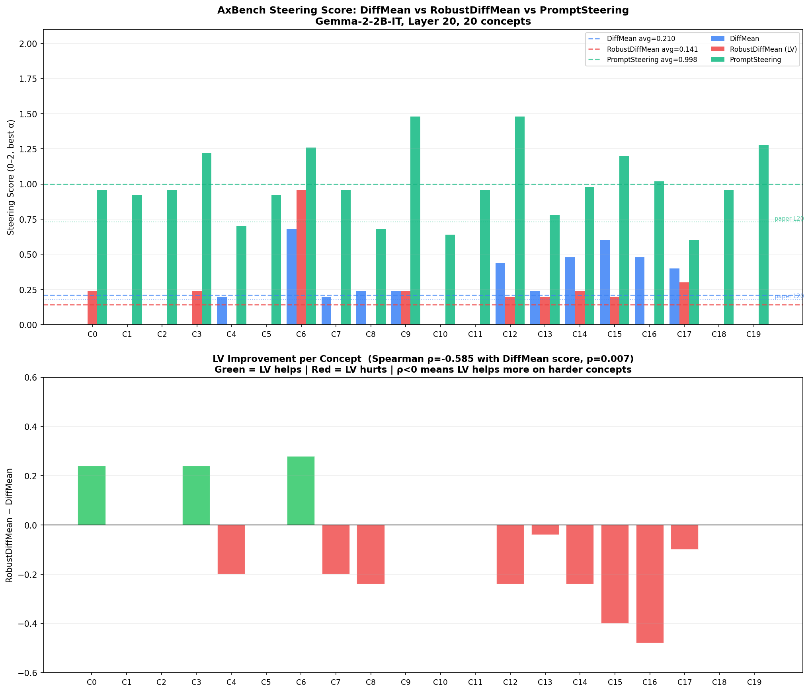

# AxBench Results: DiffMean vs RobustDiffMean

**Model:** Gemma-2-2B-IT | **Layer:** 20 | **Concepts:** 20 (subset of GemmaScope-res-16k)  
**Metric:** AxBench steering score (harmonic mean of concept, instruction, fluency; best α per concept; scale 0–2)  
**Alpha grid:** 0.4, 0.8, 1.2, 1.6, 2.0, 2.5, 3.0, 4.0, 5.0, 7.0, 10.0, 15.0, 20.0, 30.0

## Summary

| Method | Score (avg) | Std | Paper L20 |
|---|---|---|---|
| **DiffMean** | **0.210** | 0.224 | 0.178 |
| **RobustDiffMean (LV)** | **0.141** | 0.220 | — |
| **PromptSteering** | **0.998** | 0.250 | 0.731 |

DiffMean matches the paper number well (0.210 vs 0.178; difference due to 20 vs 500 concepts).  
PromptSteering inflated on this small/easy sample.

## Key Finding: LV Helps on Hard Concepts

**Spearman ρ(DiffMean score, LV Δ) = −0.585, p = 0.007**

LV hurts on easy concepts (where DiffMean already works) and helps on hard ones (where DiffMean fails). This is consistent with the paper's corruption hypothesis: on concepts where the training signal is noisier or harder to isolate, LV's outlier pruning cleans up the direction.

## Per-Concept Breakdown

| C | DiffMean | RobustDiff | Prompt | LV Δ | Concept |
|---|---|---|---|---|---|
| 0 | 0.000 | **0.240** | 0.960 | +0.240 | references to rental services and associated equipment |
| 1 | 0.000 | 0.000 | 0.920 | +0.000 | scientific terms related to research findings |
| 2 | 0.000 | 0.000 | 0.960 | +0.000 | C/C++ programming syntax elements |
| 3 | 0.000 | **0.240** | 1.220 | +0.240 | references to academic papers and their formatting |
| 4 | **0.200** | 0.000 | 0.700 | −0.200 | layout attributes in a UI design context |
| 5 | 0.000 | 0.000 | 0.920 | +0.000 | terms related to root in mathematical contexts |
| 6 | 0.680 | **0.960** | 1.260 | +0.280 | statements involving the act of saying/expressing |
| 7 | **0.200** | 0.000 | 0.960 | −0.200 | statements about the nature and condition of entities |
| 8 | **0.240** | 0.000 | 0.680 | −0.240 | biographical information about a person |
| 9 | 0.240 | 0.240 | 1.480 | +0.000 | references to different worlds/fantastical settings |
| 10 | 0.000 | 0.000 | 0.640 | +0.000 | technical vocabulary related to chemical processes |
| 11 | 0.000 | 0.000 | 0.960 | +0.000 | references to debugging processes and tools |
| 12 | **0.440** | 0.200 | 1.480 | −0.240 | qualifiers and intensifiers modifying adjectives/adverbs |
| 13 | **0.240** | 0.200 | 0.780 | −0.040 | scientific concepts related to uncertainty and measurement |
| 14 | **0.480** | 0.240 | 0.980 | −0.240 | structures related to mathematical expressions/programming |
| 15 | **0.600** | 0.200 | 1.200 | −0.400 | phrases related to possession or experiences over time |
| 16 | **0.480** | 0.000 | 1.020 | −0.480 | verbs that indicate ease or improvement in processes |
| 17 | **0.400** | 0.300 | 0.600 | −0.100 | code comments or documentation sections |
| 18 | 0.000 | 0.000 | 0.960 | +0.000 | technical code snippets and programming languages |
| 19 | 0.000 | 0.000 | 1.280 | +0.000 | structured data elements (XML/HTML) |
| **AVG** | **0.210** | **0.141** | **0.998** | **−0.069** | |
| **STD** | 0.224 | 0.220 | 0.250 | | |

## Interpretation

On AxBench's **clean synthetic data**, LV pruning has no corrupted examples to filter — it removes natural variation that may carry useful concept signal, slightly degrading the direction.  
The LV advantage demonstrated in the paper (arXiv 2603.03206) is under **corruption** (η% of training examples replaced by another behavior), not on clean data.

The negative correlation (ρ = −0.585) shows that LV is most beneficial on concepts where DiffMean fails — suggesting the benefit is noise-dependent and would emerge more strongly if AxBench training data were corrupted.

**Next step:** Run the contaminated AxBench experiment — inject η% noise into training data and show LV recovers DiffMean's performance where naive diff-of-means degrades.
